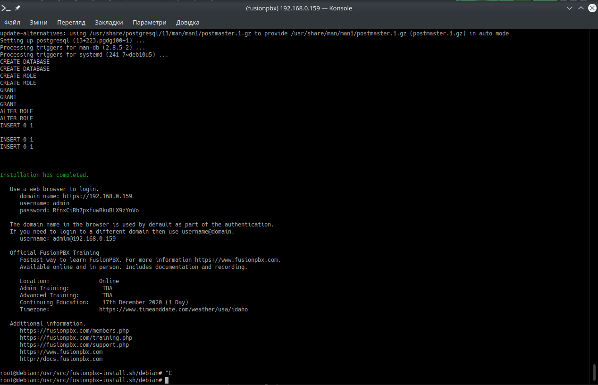

- [Fusionpbx API](#fusionpbx-api)
  - [Development environment (Virtual Box)](#development-environment-virtual-box)
    - [Install Virtual Box software and create a Debian virtual machine](#install-virtual-box-software-and-create-a-debian-virtual-machine)
    - [Install FusionPBX](#install-fusionpbx)
      - [Login into your virtual machine.](#login-into-your-virtual-machine)
      - [Run installation script](#run-installation-script)
      - [Create virtual host for API](#create-virtual-host-for-api)
      - [Enable xdebug](#enable-xdebug)
      - [Mount local folder with the API code into VM](#mount-local-folder-with-the-api-code-into-vm)
  - [Development environment (docker)](#development-environment-docker)
    - [Setup environment](#setup-environment)
    - [Daily usage](#daily-usage)
  - [Production environment](#production-environment)
    - [Introduction](#introduction)
      - [Install additional packages](#install-additional-packages)
      - [Install API project files](#install-api-project-files)
      - [Update .env file](#update-env-file)
      - [Add nginx virtual host](#add-nginx-virtual-host)
      - [Setup firewall](#setup-firewall)
      - [Get and upload apple VOIP push certificate](#get-and-upload-apple-voip-push-certificate)
      - [Setup and run socket server](#setup-and-run-socket-server)
    - [Check it's working](#check-its-working)
    - [Update](#update)
  - [Documenations](#documenations)


# Fusionpbx API

## Development environment (Virtual Box)

### Install Virtual Box software and create a Debian virtual machine

* Install [Virtual Box](https://www.virtualbox.org/)
* Download a Debian iso file and mount in using virtual box. I used amd 64 https://www.debian.org/distrib/netinst#smallcd
* Create a new virtual machine usin debian. Select startup disk your mounted iso. 
* Proceed with the install. Choose defaults when possible.  except points mentioned below. I choose root password, user name and password as `fusionpbx` for development purposes.
  * Select only neede software, no need to install DE. So disable `Debian desktop environment`, do not enable `web-server` (we don't need apache) and enable `ssh server` 
* Set network adapter to `Bridged apdapter` . You may need to reboot VM to apply new network connection. Thus the VM will be treated as a regular computer in your local network.
* Install Guest Additions.
  * Insert guest additions ISO using `VB -> Devices` menu
  * Login into VM
  * Install guest additions according to https://linuxize.com/post/how-to-install-virtualbox-guest-additions-on-debian-10/
    ```bash
    apt install build-essential dkms linux-headers-$(uname -r)
    mkdir -p /mnt/cdrom
    mount /dev/cdrom /mnt/cdrom
    cd /mnt/cdrom
    sudo sh ./VBoxLinuxAdditions.run --nox11
    sh ./VBoxLinuxAdditions.run
    systemctl reboot
    ```
* Install additional packages needed
  ```bash
  apt install -y wget curl php-zmq php-xdebug nodejs php-mbstring \
    && apt-get install -y nano mc \
    && apt install -y supervisor;
  ```

### Install FusionPBX

#### Login into your virtual machine. 

I prefer to ssh into the VM from the host machine, as the terminal in 
VirtualBox window doesn't allow to copy/paste. But first we need to know
the VM IP. So login into the VM using VirtualBox and run `hostname -I`.
It gave me the IP of the VM in my local network. 
In my case it's `192.168.0.159`


> Note! Debian doesn't allow by default to login via `ssh` as `root` 
> so we must login as a regular user and the switch to root

Next open termianl at your host machine and `ssh fusionpbx@192.168.0.159`
where `fusionpbx` is my VM user and `192.168.0.159` is the IP of the VM.
When logged in use `su` to switch to root user.

> NOTE! Lower it's assumed all linux commands are run in VM as root

#### Run installation script

When being logged into the VM as root use commads provided by FusionPBX 
doc to [install FusionPBX](https://www.fusionpbx.com/download).

A small command I needed to update GPG keys

```bash
wget --quiet -O - https://www.postgresql.org/media/keys/ACCC4CF8.asc | sudo apt-key add -
```

Next run FusionPBX installation


```bash
wget -O - https://raw.githubusercontent.com/fusionpbx/fusionpbx-install.sh/master/debian/pre-install.sh | sh;

cd /usr/src/fusionpbx-install.sh/debian && ./install.sh
```

When done, don't forget to copy the final message with login and password.

In my case smth. like this: 
```bash
      domain name: https://192.168.0.159
      username: admin
      password: RfnxCiRh7pxfuwRkuBLX9zYnVo
```



#### Create virtual host for API

Let's prepare NGINX and system for our API

```bash
cat << 'EOF' > /etc/nginx/sites-available/api
server {
        listen 443;
        server_name fusionpbx;
        ssl                     on;
        ssl_certificate         /etc/ssl/certs/nginx.crt;
        ssl_certificate_key     /etc/ssl/private/nginx.key;
        ssl_protocols           TLSv1 TLSv1.1 TLSv1.2;
        ssl_ciphers             HIGH:!ADH:!MD5:!aNULL;

        #letsencrypt
        location /.well-known/acme-challenge {
                root /var/www/letsencrypt;
        }

        access_log /var/log/nginx/access.log;
        error_log /var/log/nginx/error.log;

        client_max_body_size 80M;
        client_body_buffer_size 128k;

        location /api {
                root /var/www/laravel-api/public;
                index index.php;
                try_files $uri $uri/ /index.php?$query_string;
        }


        location ~ \.php$ {
                fastcgi_pass unix:/var/run/php/php7.3-fpm.sock;
                #fastcgi_pass 127.0.0.1:9000;
                fastcgi_index index.php;
                include fastcgi_params;
                fastcgi_param   SCRIPT_FILENAME /var/www/laravel-api/public$fastcgi_script_name;
        }

        # Disable viewing .htaccess & .htpassword & .db
        location ~ .htaccess {
                deny all;
        }
        location ~ .htpassword {
                deny all;
        }
        location ~^.+.(db)$ {
                deny all;
        }
}
EOF
ln -s /etc/nginx/sites-available/api /etc/nginx/sites-enabled/api
/etc/init.d/nginx restart
mkdir -p /var/www/laravel-api/
chown www-data:www-data laravel-api/
sudo usermod -aG vboxsf www-data
sudo iptables -A INPUT -p tcp --dport 444 --jump ACCEPT
sudo /sbin/iptables-save > /etc/iptables/rules.v4
```

#### Enable xdebug

To enable xdebug you must know your host machine IP in your local network
and the path to the xdebug.ini file. The path 

```bash
HOST_IP=$(echo $SSH_CLIENT | awk '{ print $1}')
PHP_VERSION=$(php --version | head -1 | awk '{print $2}' | cut -d. -f 1-2)
cat << EOF > /etc/php/${PHP_VERSION}/mods-available/xdebug.ini
zend_extension=xdebug.so

xdebug.remote_host="${HOST_IP}"
xdebug.remote_connect_back=1
xdebug.remote_port=9000
xdebug.idekey=PHPSTORM

xdebug.remote_autostart=1
xdebug.remote_enable=1
xdebug.cli_color=1
;xdebug.profiler_enable=0
;xdebug.profiler_output_dir="~/xdebug/phpstorm/tmp/profiling"

xdebug.remote_handler=dbgp
xdebug.remote_mode=req

xdebug.var_display_max_children=-1
xdebug.var_display_max_data=-1
xdebug.var_display_max_depth=-1
EOF
/etc/init.d/php7.3-fpm restart
```


#### Mount local folder with the API code into VM

Clone the project if not done yet

```bash
git clone git@github.com:gruz/fusionpbx-api.git
cd fusionpbx-api
git fetch --all
git checkout dev
git pull
git submodule init && git submodule update
```

Mount your local folder into VM.


Reboot VM

```bash
systemctl reboot
```

- витягнути два проекти на локалці fusionpbx і нашу АПІ
- підмінити теки на локальні
- встановити xdebug
- змінити nginx
- відкрити порти


## Development environment (docker)

For developing we use docker. So it's assumed you have docker installed,
being able to run it without `sudo` (your user is added to `docker` group).

### Setup environment

Run commands in terminal and then follow steps. After done you'll have you `fusionpbx` under https://localhost 
and api accessible under https://localhost:444

```bash
git clone git@github.com:gruz/fusionpbx-api.git
cd fusionbpx-api
bin/init
```

### Daily usage

> Make sure other services are stopped to have corresponding ports opened.

Start docker

`bin/start`

Stop docker

`bin/stop`


## Production environment

> Note, the docs below may be outdated for now. We will update them in the future.

### Introduction

It's assumed you follow FusionPBX installation manual and have your Debian server running.

The API will be accessible at your server under port 444 (you are free to change it)

The main steps would be:

* Install additional packages
* Get the API code and place it to your server
* Update .env file
* Add nginx virtual host
* Setup firewall
* Get and upload apple VOIP push certificate


#### Install additional packages

```bash
apt install composer php-zmq nodejs
```

#### Install API project files

```
# cd /var/www
# git clone git@github.com:gruz/fusionpbx-api.git laravel-api
# cd laraverl-api
# composer update
# cp .env.example .env
# chown -R www-data:www-data laravel-api
```

#### Update .env file

Next manually copy database credentials from `/etc/fusionpbx/config.php` to `/var/www/laravel-api/.env`

```bash
sudo -u www-data php artisan key:generate
sudo -u www-data php artisan migrate
sudo -u www-data php artisan passport:install
```

The latest command will generate key pairs.

Copy-paste the generated secrets and IDs into your .env file like this

```env
PERSONAL_CLIENT_ID=1
PERSONAL_CLIENT_SECRET=mR7k7ITv4f7DJqkwtfEOythkUAsy4GJ622hPkxe6
PASSWORD_CLIENT_ID=2
PASSWORD_CLIENT_SECRET=FJWQRS3PQj6atM6fz5f6AtDboo59toGplcuUYrKL
```

Change `MOTHERSHIP_DOMAIN` domain in .env to your domain.


#### Add nginx virtual host

Edit `/etc/nginx/sites-available/fusionpbx` and add code like this (note port 444 which you can change here and in the firewall section)

```
server {
        listen 444;
        server_name fusionpbx;
        ssl                     on;
        ssl_certificate         /etc/ssl/certs/nginx.crt;
        ssl_certificate_key     /etc/ssl/private/nginx.key;
        ssl_protocols           TLSv1 TLSv1.1 TLSv1.2;
        ssl_ciphers             HIGH:!ADH:!MD5:!aNULL;

        #letsencrypt
        location /.well-known/acme-challenge {
                root /var/www/letsencrypt;
        }

        access_log /var/log/nginx/access.log;
        error_log /var/log/nginx/error.log;

        client_max_body_size 80M;
        client_body_buffer_size 128k;

        location / {
                root /var/www/laravel-api/public;
                index index.php;
                try_files $uri $uri/ /index.php?$query_string;
        }


        location ~ \.php$ {
                fastcgi_pass unix:/var/run/php/php7.3-fpm.sock;
                #fastcgi_pass 127.0.0.1:9000;
                fastcgi_index index.php;
                include fastcgi_params;
                fastcgi_param   SCRIPT_FILENAME /var/www/laravel-api/public$fastcgi_script_name;
        }

        # Disable viewing .htaccess & .htpassword & .db
        location ~ .htaccess {
                deny all;
        }
        location ~ .htpassword {
                deny all;
        }
        location ~^.+.(db)$ {
                deny all;
        }
}
```

Restart server

```bash
service nginx restart
```

#### Setup firewall

Allow your port in Firewall

```bash
iptables -A INPUT -p tcp --dport 444 --jump ACCEPT
iptables -A INPUT -p tcp --dport 8080 --jump ACCEPT
```

Now we want to make firewal respect your port setting after reboot.

Save current rules to a file

```bash
iptables-save > /etc/iptables.up.rules
```

Create a boot file

```bash
nano /etc/network/if-pre-up.d/iptables
```

with contents

```bash
#!/bin/sh
/sbin/iptables-restore < /etc/iptables.up.rules
```

Make it executable

```bash
chmod +x /etc/network/if-pre-up.d/iptables
```

#### Get and upload apple VOIP push certificate

This is needed to send push notifications to wakeup Apple devices.
Get the certificate at Apple Developer Portal and place it to **resources/certs/VOIP.pem**

Edit `.env` file and place the path to the cert file as well as password if you have it setup.

Search for `VOIP_APPLE_CERT_PATH` and `VOIP_APPLE_CERT_PASSPHRASE` in your `.env` file.

#### Setup and run socket server

For production site create configuration suppressing output

```bash
cat <<EOF > /etc/supervisor/conf.d/laravel-ratchet.conf
[program:laravel-ratchet]
process_name=%(program_name)s_%(process_num)02d
command=php /var/www/laravel-api/artisan ratchet:serve --driver=IoServer -q
autostart=true
autorestart=true
user=www-data
numprocs=1
redirect_stderr=true
stdout_logfile=/var/www/laravel-api/storage/logs/ratchet.log
EOF
```

For dev site use the same config except the -q key

```bash
cat <<EOF > /etc/supervisor/conf.d/laravel-ratchet.conf
[program:laravel-ratchet]
process_name=%(program_name)s_%(process_num)02d
command=php /var/www/laravel-api/artisan ratchet:serve --driver=IoServer
autostart=true
autorestart=true
user=www-data
numprocs=1
redirect_stderr=true
stdout_logfile=/var/www/laravel-api/storage/logs/ratchet.log
EOF
```

Enable and start

```bash
sudo supervisorctl reread
sudo supervisorctl update
supervisorctl start laravel-ratchet:*
```

### Check it's working

If you open **https://yoursite.com:444** (note HTTPS!) you should see something like

```json
{"title":"FusionPBX API","version":"0.0.1"}
```

### Update

Login to your server via ssh and go to the laravel folder

```bash
cd /var/www/laravel-api/
```

Switch to `www-data` user
```bash
su -m -l www-data
```

> Don't care when you get `-su: /root/.bash_profile: Permission denied`. Just ignore.


```bash
git pull
```

Install composer packaged to get new added packages and remove unneeded ones

```bash
composer install
```

Run laravel migration

```bash
php artisan migrate
```

Check `.env.example` file for new entries (compare it with your current file). If there are new lines at the bottom, then update your `.env` file with the new files.

Check if your certificates (like VOIP push cert) are in place.

## Documenations

Check this repository wiki
