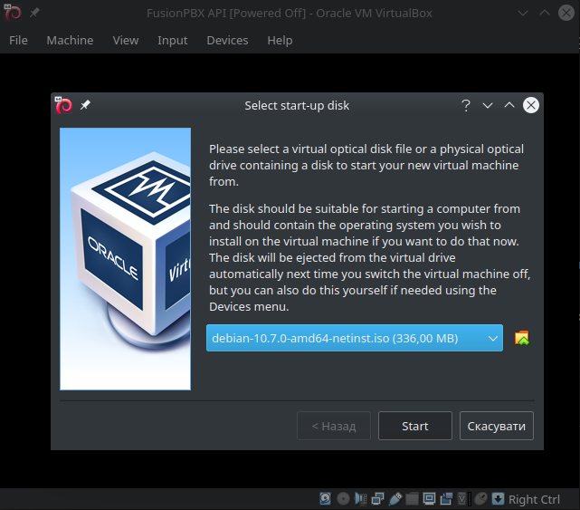
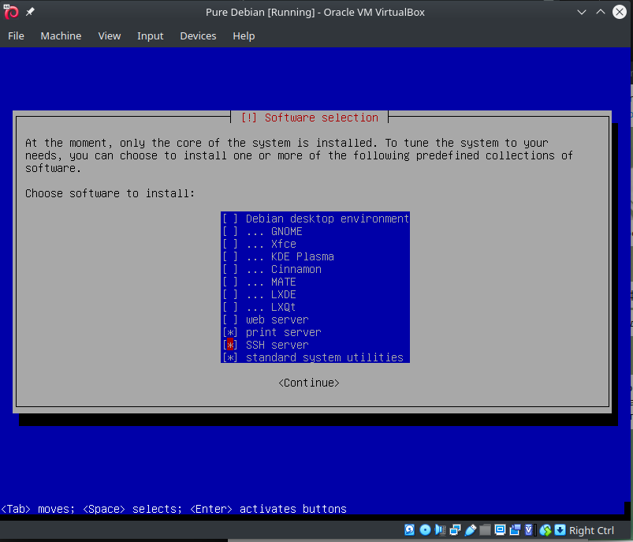
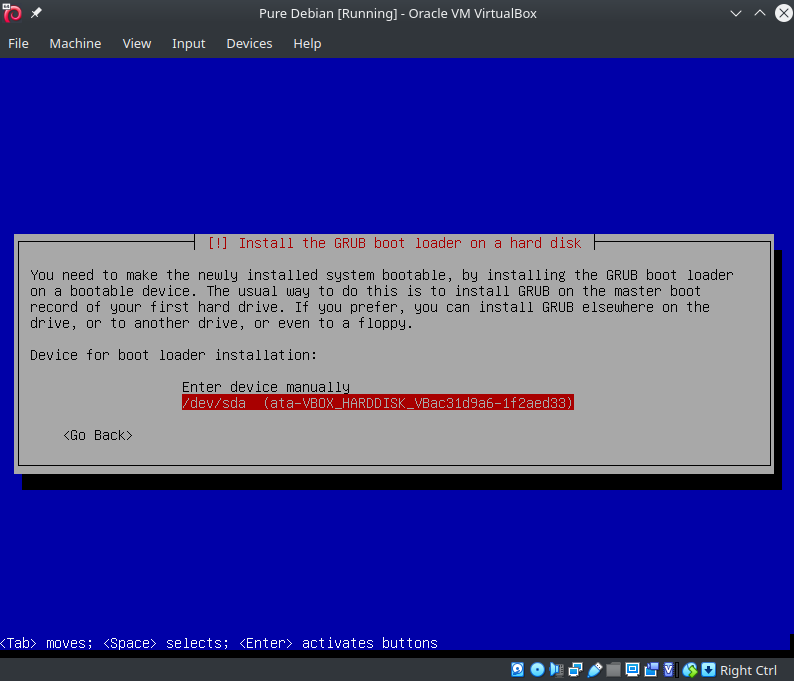
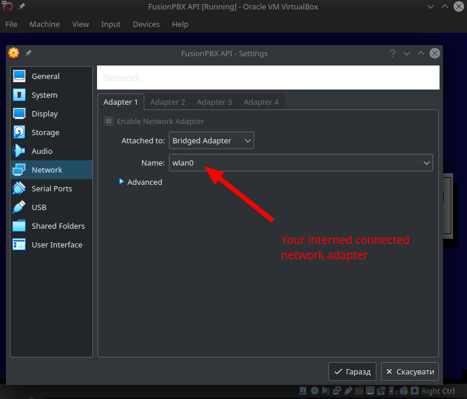
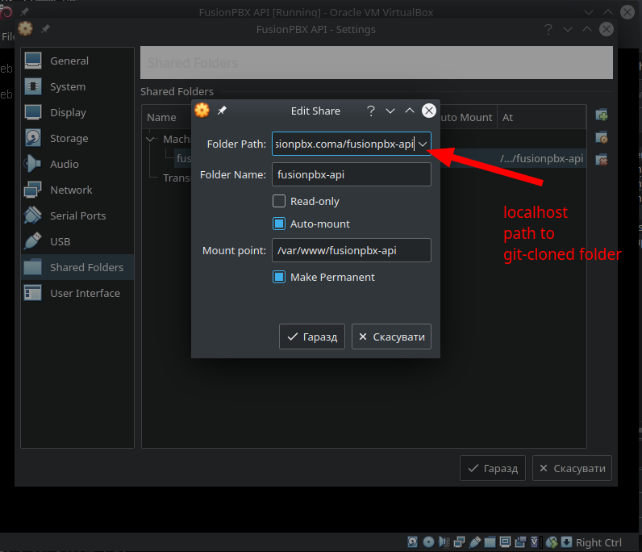
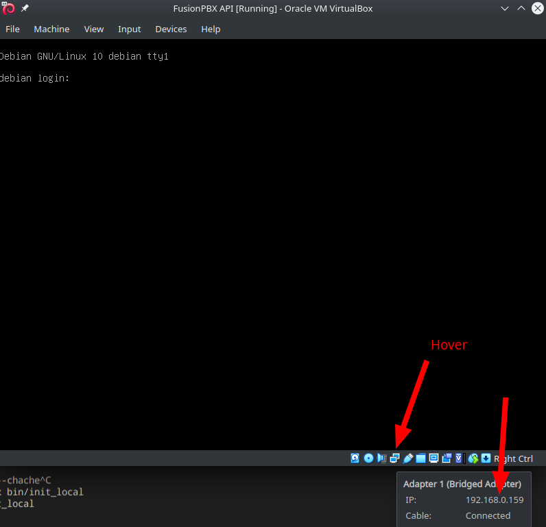
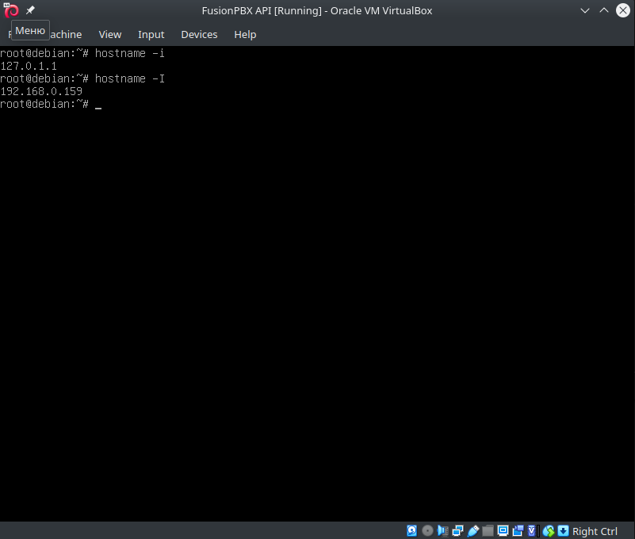

- [Fusionpbx API](#fusionpbx-api)
  - [Server installation](#server-installation)
  - [Development environment setup (Virtual Box)](#development-environment-setup-virtual-box)
    - [Clone project to locahost](#clone-project-to-locahost)
    - [Install Virtual Box software and create a Debian virtual machine](#install-virtual-box-software-and-create-a-debian-virtual-machine)
    - [Run installation script](#run-installation-script)
    - [Login into debian](#login-into-debian)
    - [Install FusionPBX and API](#install-fusionpbx-and-api)
    - [Update mail settings](#update-mail-settings)
  - [Docker setup](#docker-setup)
  - [Documenation](#documenation)


# Fusionpbx API

> It's a very early development stage for a FusionPBX API using Laravel.

## Server installation

```bash
git clone https://github.com/gruz/fusionpbx-api.git /var/www/fusionpbx-api
chown -R www-data:www-data /var/www/fusionpbx-api
cd /var/www/fusionpbx-api
git fetch --all
bin/init_server
```

## Development environment setup (Virtual Box)

### Clone project to locahost

Get project files and init submodules (fusionpbx code is neede for api development as well)

```bash
git clone git@github.com:gruz/fusionpbx-api.git
cd fusionpbx-api
git fetch --all
bin/init_local
```

### Install Virtual Box software and create a Debian virtual machine

* Install [Virtual Box](https://www.virtualbox.org/). Don't forget to add yourself to `vboxusers` group and reboot after install.
* Download a Debian iso file and mount in using virtual box. I used amd 64 https://www.debian.org/distrib/netinst#smallcd
* Create a new virtual machine using `Debian`. Select startup disk your mounted iso. 
* Proceed with the install. I choose root password, user name and password as `fusionpbx` for development purposes. Select only needed software, no need to install DE. So disable `Debian desktop environment`, do not enable `web-server` (we don't need apache) and enable `ssh server`  Don't forget to set boot device at the final installation step. 
* Set network adapter to `Bridged apdapter` . You may need to reboot VM to apply new network connection. Thus the VM will be treated as a regular computer in your local network.
* Insert guest additions ISO using `VB -> Devices` menu
* Create a shared folder pointing to your localhost project folder with remote path `/var/www/fusionpbx-api`. Ignore possible "Not installed guest additions" message for now. 

### Run installation script
From your host computer being in project folder copy script file to VB like this

```bash
scp bin/init_vb fusionpbx@192.168.0.160:/tmp
```

### Login into debian

In-VirtualBox terminal doesn't allow to use copy/paste. So it's preferable to ssh into the VM from the host machine to use convinient terminal.
But first we need to know the VM IP.

There are two ways. Either just hover VM window icon to get the IP

or login into debian inside VM and run `hostname -I`.
In my case it's `192.168.0.160`


> Note! Debian doesn't allow by default to login via `ssh` as `root`
> so we must login as a regular user and the switch to root

Next open termianl at your host machine and `ssh fusionpbx@192.168.0.160`
where `fusionpbx` is my VM user and `192.168.0.160` is the IP of the VM.
When logged in use `su` to switch to root user.

### Install FusionPBX and API

Login like `ssh fusionpbx@192.168.0.160`

Switch to root using `su` command.

Run the init script. It will reboot the VM when done.

```bash
/tmp/init_vb
```

After reboot again login into VB and switch to root `ssh fusionpbx@192.168.0.160`, `su`

If everything is ok, then command `ls -la /var/www/fusionpbx-api` should laravel api project folder, cloned from git (where folders `bin`, `fusionpbx`, `laravel-api`, `docs` are)

```bash
cd /var/www/fusionpbx-api
bin/init_vb_software
```

When done you should be able to see fusionpbx site at `https://192.168.0.160` and API message at `https://192.168.0.160:444`

### Update mail settings

Update `.env` file with your mail settings

## Docker setup

I didn't manage to create a docker for developemnt after many tries.

So if you wish to help, then offer a docker setup for the project.

Requirements I see:

* Both FusionPBD and this API code can be examined with xdebug
* SIP phone can register at the server
 
## Documenation

Check this repository wiki